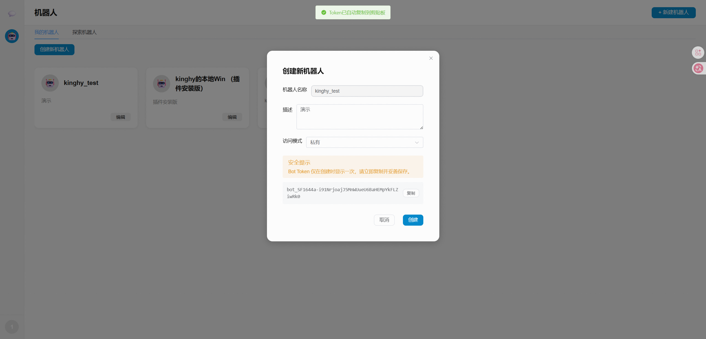

# @botlink/openclaw-botlink-channel

OpenClaw 的 Botlink 渠道插件。  
传输方式：Botlink Telegram 兼容 HTTP API（`/bot{token}/{method}`），入站模式使用长轮询（Long Polling）。

## 环境要求

- Node.js 20+3
- OpenClaw CLI（建议 `2026.3.x` 或更新版本）

## 功能（v1.0.3）

- 文本消息收发
- 媒体消息收发
- 消息编辑/删除动作
- 消息反应动作
- 新增多agent支持

## 如何获取 botToken

1. 登录 `https://test.51yzt.cn`，进入“机器人”页面。
2. 在“我的机器人”中点击“创建新机器人”。
3. 填写机器人名称、描述和访问模式后，点击“创建”。
4. 在创建成功弹窗中复制 `Bot Token`（该 Token 通常仅在创建时展示一次）。
5. 将复制的 Token 用于 OpenClaw 配置中的 `--token` 参数。

示意图（创建机器人并复制 Bot Token）：



## 新用户首次接入（必须先做）

首次使用本插件时，请先完成本节；多 AGENT 属于后续扩展，见下文“多账号（多 Agent）扩展（可选）”。

1. 克隆仓库并进入目录：

```bash
git clone https://github.com/kinghy949/openclaw-botlink-channel.git
```

```bash
cd openclaw-botlink-channel
```

2. 安装并启用插件（`openclaw-botlink-channel` 是插件 ID，`botlink` 是渠道 ID）：

```bash
# 注意末尾的 "." 不能省略
openclaw plugins install .
```

```bash
openclaw plugins enable openclaw-botlink-channel
```

3. 添加 Botlink 渠道账号并检查状态：

```bash
openclaw channels add --channel botlink --token <botToken> --http-url https://test.51yzt.cn
```
```bash
openclaw channels status
```

4. 可选：探测远端连通性（需要网关运行且凭据有效）：

```bash
openclaw channels status --probe --timeout 10000
```

## 必需的 OpenClaw 渠道配置

`channels.botlink` 需要：

- `botToken`（必填）
- `apiBaseUrl`（必填，无默认值）

示例：

```jsonc
{
  "channels": {
    "botlink": {
      "enabled": true,
      "botToken": "<botToken>",
      "apiBaseUrl": "https://test.51yzt.cn"
    }
  }
}
```

## 多 Agent扩展（可选）

如果你要在 Botlink 中使用多个Agent（每个Agent一个 `botToken`），请使用 `channels.botlink.accounts`，并在 `bindings[].match.accountId` 里把不同账号路由到不同 agent。

> `peer.id` 不能替代 `botToken`。  
> `peer.id` 是路由匹配维度（谁在说话/哪个群），`botToken` 是连接哪个机器人账号的鉴权凭据。

示例：

```jsonc
{
  "channels": {
    "botlink": {
      "enabled": true,
      "apiBaseUrl": "https://test.51yzt.cn",
      "defaultAccount": "sales",
      "accounts": {
        "sales": {
          "botToken": "<TOKEN_SALES>",
          "name": "sales-bot",
          "groupRequireMention": true
        },
        "support": {
          "botToken": "<TOKEN_SUPPORT>",
          "name": "support-bot",
          "groupRequireMention": true
        }
      }
    }
  },
  "bindings": [
    {
      "match": { "channel": "botlink", "accountId": "sales" },
      "agentId": "agent-sales"
    },
    {
      "match": { "channel": "botlink", "accountId": "support" },
      "agentId": "agent-support"
    }
  ]
}
```

说明：

- 单聊：用户给哪个 bot 发消息，就会进入哪个 `accountId`，再按 `bindings` 路由到对应 agent。
- 群聊：当 `groupRequireMention: true` 时，只处理 `@当前 bot`（或回复该 bot）的消息。

### 通过 CLI 新增 Agent 并绑定 Botlink 账号

新增一个 agent 时，按以下顺序执行：

```bash
openclaw agents add <agentName>
openclaw channels add --channel botlink --account <agentName> --token <botToken> --http-url https://test.51yzt.cn
openclaw agents bind --agent <agentName> --bind botlink:<agentName>
```

说明：

- `<>` 中的值由用户自行指定。
- 同一次新增流程中，`<agentName>` 在三条命令里必须保持一致。
- `<botToken>` 使用该 Botlink 机器人的真实 Token。

示例（`agentName = kinghy`）：

```bash
openclaw agents add kinghy
openclaw channels add --channel botlink --account kinghy --token bot_4RZ*******FiwwTfMyvfc --http-url https://test.51yzt.cn
openclaw agents bind --agent kinghy --bind botlink:kinghy
```

## 本地开发（可选）

如果你在调试插件代码并希望直接引用工作区源码（不复制到 OpenClaw 扩展目录）：

```bash
npm install
openclaw plugins install . --link
openclaw plugins enable openclaw-botlink-channel
```

## 通过 npm 安装 / 启用 / 配置

如果包已发布：

```bash
openclaw plugins install @<scope>/openclaw-botlink-channel
openclaw plugins enable openclaw-botlink-channel
openclaw channels add --channel botlink --token <botToken> --http-url <apiBaseUrl>
openclaw channels status --probe --timeout 10000
```

本包示例：

```bash
openclaw plugins install @botlink/openclaw-botlink-channel
openclaw plugins enable openclaw-botlink-channel
openclaw channels add --channel botlink --token <botToken> --http-url <apiBaseUrl>
openclaw channels status --probe --timeout 10000
```

## 发布（npm）

该插件提供 TypeScript 入口，并使用 `openclaw.extensions = ["./index.ts"]`。

1. 更新 `package.json` 中的版本号。
2. 打包测试：

```bash
npm pack
```

3. 发布：

```bash
npm publish --access public
```

4. 通过 npm 包名进行安装测试：

```bash
openclaw plugins install @<scope>/openclaw-botlink-channel
```
